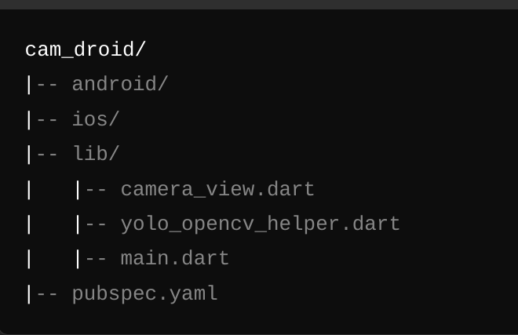

# cam_droid



A new Flutter project for capturing and processing images using OpenCV and YOLO.

## Getting Started

This project demonstrates the use of Flutter for developing a mobile application that integrates with the device's camera to capture images and processes them using OpenCV and YOLO. The project includes the setup for both Flutter and native Android code to handle image processing.

### Project Structure

- **lib/**: Contains the main Flutter application code.
  - `camera_view.dart`: Handles the camera functionality and image capturing.
  - `yolo_opencv_helper.dart`: Facilitates communication with the native Android code for image processing.
  - `main.dart`: Entry point of the Flutter application.
- **android/**: Contains the native Android code.
  - `MainActivity.kt`: Sets up the MethodChannel to communicate with Flutter and handles image processing using OpenCV and YOLO.
  - `YoloOpencvHelper.kt`: Contains the implementation of image processing using OpenCV and YOLO.
- **ios/**: Contains iOS-specific configurations (if needed in the future).
- **pubspec.yaml**: Defines the dependencies and metadata for the Flutter project.

### Features

- Capture images using the device's camera.
- Process captured images using OpenCV and YOLO for object detection.
- Display the processed images in the Flutter application.

### Installation

To set up the project locally, follow these steps:

1. **Clone the repository:**

   ```bash
   git clone 
   cd cam_droid
